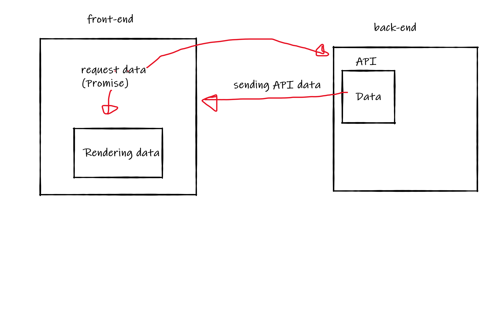
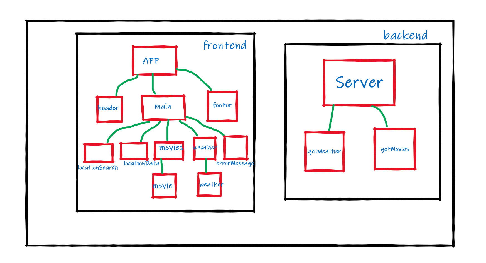
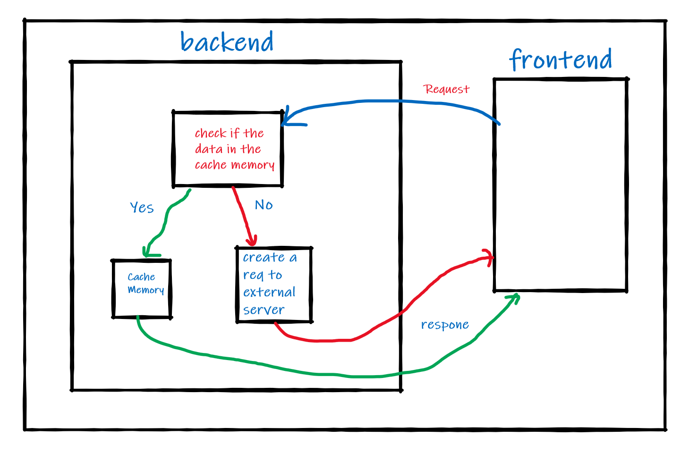

# City Explorer

**Author**: Qusay Al-Amarat
**Version**: 1.0.0 (increment the patch/fix version number if you make more commits past your first submission)

## Overview
This app to explorer cities and locations map by inputing the location name
<!-- Provide a high level overview of what this application is and why you are building it, beyond the fact that it's an assignment for this class. (i.e. What's your problem domain?) -->

## Getting Started
<!-- What are the steps that a user must take in order to build this app on their own machine and get it running? -->

## Architecture
<!-- Provide a detailed description of the application design. What technologies (languages, libraries, etc) you're using, and any other relevant design information. -->

## Change Log
<!-- Use this area to document the iterative changes made to your application as each feature is successfully implemented. Use time stamps. Here's an example:

01-01-2001 4:59pm - Application now has a fully-functional express server, with a GET route for the location resource. -->

## Credit and Collaborations

# WorkFlow:
    

# WRRC for lab07 :

    

# WRRC for lab08 :

    

# WRRC for lab09 :

    

# WRRC for lab10 :

